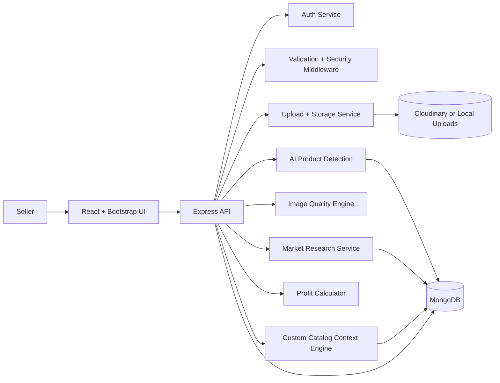

# DK Trendify AI Catalogue System

## 1. Project Overview
DK Trendify AI Catalogue System is a MERN SaaS platform for Meesho sellers. It combines authenticated catalogue workflows, AI-assisted product detection, image quality validation, market intelligence, profit estimation, and custom catalog form inputs.

The app is built to be modular, beginner-friendly, and ready for future SaaS scale-out with external AI providers, object storage, and queue workers.

## 2. Features
### Authentication
- JWT signup and login
- Password hashing with `bcryptjs`
- Role-based access for `Admin` and `Seller`
- Protected dashboard, upload, and profit endpoints

### Image Upload and Storage
- Supports JPG, PNG, and WEBP
- File size validation up to 8 MB
- Local storage fallback with optional Cloudinary configuration
- Single image upload flow with custom catalog fields

### Smart Validation Engine
- Blur detection through image edge analysis
- Watermark and corner overlay heuristics
- OCR-based text detection fallback for price/text overlays
- Distortion and stretched-image checks
- Automatic orientation correction via Sharp rotation handling

### Meesho Rules Guidance Layer
- Rule-based compliance checks are returned with each analysis result.
- Includes pass/fail checks for overlays, watermark signals, clarity, and distortion.
- Provides listing recommendations aligned to Meesho-style catalogue hygiene.

### AI Product Detection
- OpenAI Vision integration when `OPENAI_API_KEY` is available
- Heuristic fallback based on category libraries and image profile signals
- Generates product name, category, tags, and a catalogue description

### Market Research Engine
- Fetches public signals from Amazon, Flipkart, and Google Trends pages
- Provides price range, demand level, competition level, and trending keywords
- Uses graceful fallback when fetches are rate-limited or blocked

### Profit Calculator
- Inputs: cost price, commission rate, target margin
- Outputs: suggested selling price, commission, net profit, profit margin

### Return Risk Analyzer
- Low, medium, and high risk classification
- Rule-based category mapping for decor, gadgets, clothing, electronics, and utility categories

### Product Suggestion Engine
- Trending product recommendations
- High profit potential labels
- Low return risk labels

### Custom Catalog Form
- Seller can provide target audience, style, material, use-case, region, season, custom keywords, and competitor reference.
- These fields tune Google-oriented scraping query context.
- System returns a customized catalog answer including optimized title, buyer persona, query used, and suggested bullets.

### Analytics Dashboard
- Trending products
- Category demand
- Average margin
- Rejected uploads
- Return risk distribution

## 3. System Architecture Diagram


## 4. Database Schema
Primary collections:
- `users`
- `analyses`

Detailed schema notes are in [database/schema.md](../database/schema.md).

Meesho upload and listing rule reference is in [docs/meesho-catalog-rules.md](./meesho-catalog-rules.md).

Custom catalog field workflow reference is in [docs/custom-catalog-form-guide.md](./custom-catalog-form-guide.md).

## 5. API Endpoints
### Auth
`POST /api/auth/signup`

Request:
```json
{
	"name": "Aman",
	"email": "aman@example.com",
	"password": "secret1234",
	"role": "Seller"
}
```

Response:
```json
{
	"success": true,
	"data": {
		"token": "jwt-token",
		"user": {
			"id": "...",
			"name": "Aman",
			"email": "aman@example.com",
			"role": "Seller"
		}
	}
}
```

### Single Analysis
`POST /api/uploads/analyze`

Form data:
- `image` file
- `costPrice` number
- `targetAudience` string
- `style` string
- `material` string
- `useCase` string
- `region` string
- `season` string
- `customKeywords` string
- `competitorReference` string

Response:
```json
{
	"success": true,
	"data": {
		"productName": "Decorative Wall Accent - Home Decor",
		"category": "Home Decor",
		"market": { "priceRange": "₹249 - ₹899" },
		"profit": { "netProfit": 120 },
		"customizedCatalog": { "optimizedTitle": "..." }
	}
}
```

### Profit Calculator
`POST /api/profit`

Request:
```json
{
	"costPrice": 499,
	"commissionRate": 12,
	"targetMargin": 35
}
```

### Dashboard
`GET /api/dashboard`

### Health
`GET /api/health`

## 6. Installation Guide
1. Install Node.js 18+ and MongoDB 6+.
2. Copy `.env.example` to `.env` and configure the secrets.
3. Run `npm install` at the repository root.
4. Start the backend and frontend with `npm run dev`.

Default local config created by this setup:
- `SERVER_NAME=DK`
- `DB_NAME=DK`
- `MONGODB_URI=mongodb://127.0.0.1:27017/DK`

Frontend default port: `5173`
Backend default port: `5000`

## 7. Deployment Guide
### Frontend
- Deploy the Vite build to Vercel or Netlify.
- Set `VITE_API_BASE_URL` to the live backend URL.

### Backend
- Deploy to Render or Railway.
- Set `MONGODB_URI`, `JWT_SECRET`, `CLIENT_ORIGIN`, and optional OpenAI/Cloudinary settings.
- Use a production process manager and HTTPS reverse proxy.

### Database
- Use MongoDB Atlas in production.
- Enable network allowlists and backups.

## 8. Security Best Practices
- Use JWT authentication for every protected route.
- Hash passwords with `bcryptjs`.
- Add `helmet` to harden HTTP headers.
- Rate limit login and upload routes.
- Validate request bodies with Joi.
- Restrict upload mime types and size.
- Sanitize file names before writing to storage.
- Keep OpenAI and Cloudinary secrets in environment variables only.

## 9. Scalability Strategy
- Add cached templates for frequently used custom catalog contexts.
- Move heavy scraping and AI calls to queue workers when traffic grows.
- Cache trend and dashboard queries.
- Store image assets in Cloudinary or S3 instead of local disk.
- Split analytics, scraping, and AI calls into separate services if usage grows.
- Add team and workspace isolation for agency accounts.

## 10. Business Model (SaaS Pricing Tiers)
- Starter: basic single-image catalogue analysis for individual sellers.
- Growth: richer custom catalog templates, Google-intent optimization, and profit tools.
- Pro: team access, advanced analytics, and branded reports.
- Enterprise: multi-seller workspaces, custom integrations, and SLA support.

## 11. Future Enhancements
- Real queue workers with Redis or BullMQ
- S3/Cloudinary upload switcher with signed URLs
- CSV export and PDF catalogue packs
- Better model-based product detection with trained computer vision models
- Seller CRM, notifications, and listing publish workflows
